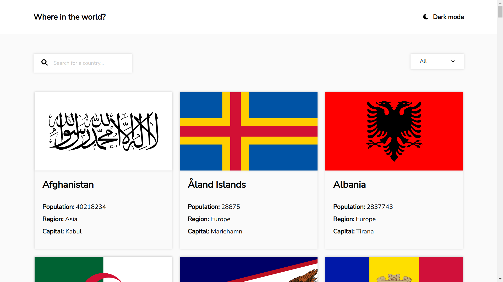

# Frontend Mentor - REST Countries API with color theme switcher solution

This is a solution to the [REST Countries API with color theme switcher challenge on Frontend Mentor](https://www.frontendmentor.io/challenges/rest-countries-api-with-color-theme-switcher-5cacc469fec04111f7b848ca).

## Table of contents

- [Overview](#overview)
  - [The challenge](#the-challenge)
  - [Screenshot](#screenshot)
  - [Links](#links)
- [My process](#my-process)
  - [Built with](#built-with)
  - [What I learned](#what-i-learned)
  - [Continued development](#continued-development)
  - [Useful resources](#useful-resources)

## Overview

### The challenge

Users should be able to:

- See all countries from the API on the homepage
- Search for a country using an `input` field
- Filter countries by region
- Click on a country to see more detailed information on a separate page
- Click through to the border countries on the detail page
- Toggle the color scheme between light and dark mode *(optional)*

### Screenshot

### Links

- [Solution URL](https://www.frontendmentor.io/solutions/rest-countries-api-using-sass-react-BkaXnS3r5)
- [Live Site URL](https://rodri-97.github.io/rest-countries-api/)

## My process

### Built with

- Mobile-first workflow
- Semantic HTML5 markup
- CSS custom properties
- Flexbox
- CSS Grid
- [Sass](https://sass-lang.com/)
- [React](https://reactjs.org/) - JS library

### What I learned

- Get data from an API.
- React Router.
- Use icons in React.

### Continued development

I did this project a single CSS/Sass file because I thought there wouldn't be too much styling, but if I had to do it again I'd make a CSS/Sass file for each component.

### Useful resources

- [React | Font Awesome Docs](https://fontawesome.com/v5/docs/web/use-with/react) - Helped with inserting icons in React.
- [React Router | Tutorial](https://reactrouter.com/docs/en/v6/getting-started/tutorial) - Helped with React Router.